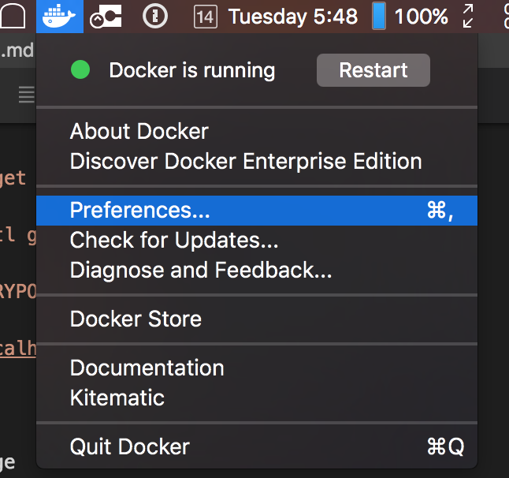

start minikube

`minikube start --memory 4000`

once finished test status

`kubectl cluster-info`

enable addons

`minikube addon enable heapster; minikube enable ingress`

wait for all pods to finish deploying

`kubectl get pods --all-namespaces`

Deploy public image from dockerhub: https://hub.docker.com/_/nginx/

`kubectl run nginx image=nginx:latest`

get pod name

`kubectl get pods`

port forward to pod via name

`kubectl port-forward PODNAME 8888:80`

view running on http://localhost:8888

setup registry

`kubectl apply -f volumes.yml`

`kubectl apply -f mysql.yml`

`kubectl apply -f europa.yml`

wait for pods with `kubectl get pods`

get registry pod with `kubectl get pods`

`kubectl port-forward REGISTRYPOD 5000:80`

setup registry at `http://localhost:5000`

set /europa for storage. 

Generate token on settigs page

### The following steps are for osx/windows

Find minikube IP

`minikube ip`

open docker settings from the toolbar 




add the registry endpoint to your insecure registry list. It will be `MINIKUBEIP:30912`


restart docker after making the change

login to registry

`docker login -u TOKEN -p TOKENHERE http://MINIKUBEIP:30912`

### the following steps are for linux

edit `/etc/default/docker` and add `--indecure-registries=http://MINIKUBEIP:30912` to DOCKER_OPTS

restart docker

### the next steps apply to all operating systems

login on minikube as well so it can pull private images

```
minikube ssh
docker login -u TOKEN -p TOKENHERE localhost:30912`
exit
```

build custom image locally first

`cd part1/hello-kenzan;`

`docker build -t MINIKUBEIP:30912/hellokenzan:latest .`

`docker push MINIKUBEIP:30912/hellokenzan:latest`

ensure image is pushed by viewing ui at http://localhost:5000. 

In settings change private to public

put minikube ip `minkube ip` in deployment.yaml

`kubectl apply -f k8s/deployment.yaml`

view at `http://hello-kenzan.MINIKUBEIP.xipio`